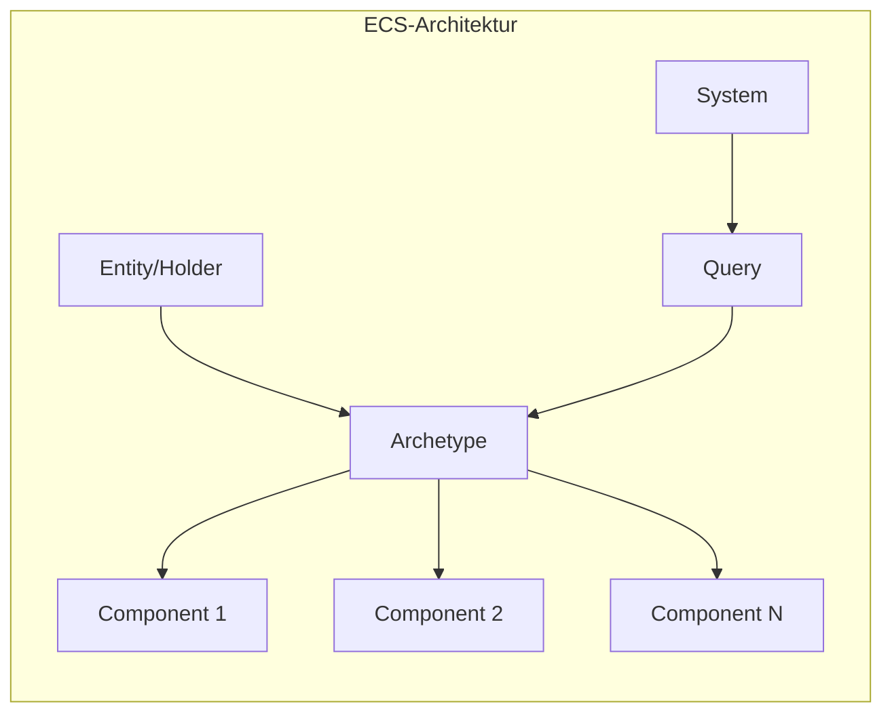

# Entity Component System (ECS)

Das Hytale ECS ist ein datenzentriertes System für die Verwaltung von Spielobjekten.

---

## Kernkonzepte



| Konzept | Beschreibung |
|---------|--------------|
| **Entity** | Identität ohne eigene Daten (via `Holder` repräsentiert) |
| **Component** | Reine Datencontainer |
| **Archetype** | Kombination von ComponentTypes einer Entity |
| **System** | Logik die auf Komponenten operiert |
| **Store** | Zentraler Datenspeicher |

---

## Component Interface

```java
public interface Component<ECS_TYPE> extends Cloneable {
    // Leeres Array für Entities ohne Komponenten
    Component[] EMPTY_ARRAY = new Component[0];
    
    // Deep-Clone der Komponente
    @Nullable Component<ECS_TYPE> clone();
    
    // Clone nur serialisierbarer Daten
    @Nullable default Component<ECS_TYPE> cloneSerializable() {
        return this.clone();
    }
}
```

### Eigene Komponente erstellen

```java
public class HealthComponent implements Component<EntityStore> {
    private int health;
    private int maxHealth;
    
    public HealthComponent(int maxHealth) {
        this.health = maxHealth;
        this.maxHealth = maxHealth;
    }
    
    public int getHealth() { return health; }
    public void setHealth(int health) { this.health = health; }
    public int getMaxHealth() { return maxHealth; }
    
    @Override
    public Component<EntityStore> clone() {
        HealthComponent clone = new HealthComponent(maxHealth);
        clone.health = this.health;
        return clone;
    }
}
```

---

## Holder (Entity-Container)

Der `Holder` ist der Hauptcontainer für Entity-Daten:

```java
public class Holder<ECS_TYPE> {
    private Archetype<ECS_TYPE> archetype;      // Aktueller Typ
    private Component<ECS_TYPE>[] components;   // Komponenten-Array
    private StampedLock lock;                   // Thread-Safety
    
    // CRUD-Operationen für Komponenten
    void addComponent(ComponentType, Component);
    void removeComponent(ComponentType);
    void replaceComponent(ComponentType, Component);
    <T> T getComponent(ComponentType<ECS_TYPE, T>);
    void putComponent(ComponentType, Component);  // Add or Replace
    
    // Utilities
    void ensureComponent(ComponentType);  // Lazy-Add
    <T> T ensureAndGetComponent(ComponentType);
    boolean tryRemoveComponent(ComponentType);
    
    // Cloning
    Holder<ECS_TYPE> clone();
    Holder<ECS_TYPE> cloneSerializable(Data);
}
```

### Komponenten-Operationen

```java
// Komponente hinzufügen
holder.addComponent(HEALTH_TYPE, new HealthComponent(100));

// Komponente abrufen
HealthComponent health = holder.getComponent(HEALTH_TYPE);

// Komponente ersetzen
holder.replaceComponent(HEALTH_TYPE, new HealthComponent(200));

// Komponente entfernen
holder.removeComponent(HEALTH_TYPE);

// Add oder Replace
holder.putComponent(HEALTH_TYPE, health);

// Lazy-Add (nur wenn nicht vorhanden)
holder.ensureComponent(HEALTH_TYPE);
HealthComponent h = holder.ensureAndGetComponent(HEALTH_TYPE);
```

---

## Archetype

Ein `Archetype` definiert, welche Komponenten eine Entity hat:

```java
public class Archetype<ECS_TYPE> {
    // Prüfen ob Komponente vorhanden
    boolean contains(ComponentType type);
    
    // Archetype-Operationen
    static Archetype add(Archetype, ComponentType);
    static Archetype remove(Archetype, ComponentType);
    static Archetype of(ComponentType... types);
    static Archetype empty();
    
    // Iteration
    int length();
    int getMinIndex();
    ComponentType get(int index);
}
```

---

## ComponentRegistry

Zentrale Registrierung für Komponenten-Typen:

```java
public class ComponentRegistry<ECS_TYPE> {
    // Komponente erstellen
    <T> T createComponent(ComponentType<ECS_TYPE, T> type);
    
    // Neuen Holder erstellen
    Holder<ECS_TYPE> newHolder();
    Holder<ECS_TYPE> newHolder(Archetype, Component[]);
    
    // Unbekannte Komponenten-Type
    ComponentType<ECS_TYPE, UnknownComponents> getUnknownComponentType();
}
```

---

## ComponentType

Typisierter Marker für Komponenten:

```java
public class ComponentType<ECS_TYPE, T extends Component<ECS_TYPE>> {
    // Index im Komponenten-Array
    int getIndex();
    
    // Validierung
    void validate();
}
```

---

## Annotations

| Annotation | Beschreibung |
|------------|--------------|
| `@NonSerialized` | Komponente wird nicht gespeichert |
| `@NonTicking` | System-Tick überspringen |

---

## Store

Der `Store` (98KB!) ist der zentrale Datenspeicher:

```java
public class Store<ECS_TYPE> {
    // Entity-Management
    Holder<ECS_TYPE> createEntity();
    void destroyEntity(Holder);
    
    // Queries für Systems
    Query<Holder> query(ComponentType... required);
    
    // Tick-Verarbeitung
    void processSystems(SystemGroup);
}
```

---

## SystemGroup & SystemType

Systems sind in Gruppen organisiert:

```java
public class SystemGroup {
    // System-Gruppe für Tick-Verarbeitung
}

public class SystemType {
    // Einzelnes System
}
```

---

## Sub-Packages

| Package | Inhalt |
|---------|--------|
| `component/data/` | Daten-Strukturen |
| `component/query/` | Entity-Queries |
| `component/system/` | ECS-Systems |
| `component/event/` | ECS-Events |
| `component/spatial/` | Räumliche Indizierung |
| `component/task/` | Async-Tasks |
| `component/metric/` | Performance-Metriken |
| `component/dependency/` | Abhängigkeiten |

---

## Thread-Safety

Der `Holder` verwendet `StampedLock` für Thread-Sicherheit:

```java
// Lese-Operationen
long stamp = lock.readLock();
try {
    // Komponente lesen
} finally {
    lock.unlockRead(stamp);
}

// Schreib-Operationen
long stamp = lock.writeLock();
try {
    // Komponente ändern
} finally {
    lock.unlockWrite(stamp);
}
```

---

## Referenzen

| Klasse | Größe | Beschreibung |
|--------|-------|--------------|
| `Store.java` | 98KB | Haupt-Datenspeicher |
| `ComponentRegistry.java` | 72KB | Registrierung |
| `Holder.java` | 23KB | Entity-Container |
| `Archetype.java` | 12KB | Typ-Definition |
| `ArchetypeChunk.java` | 13KB | Archetype-Chunks |

---

## Weiterführend

- [Architektur-Übersicht](overview.md)
- [Event-System](../systems/events.md)
