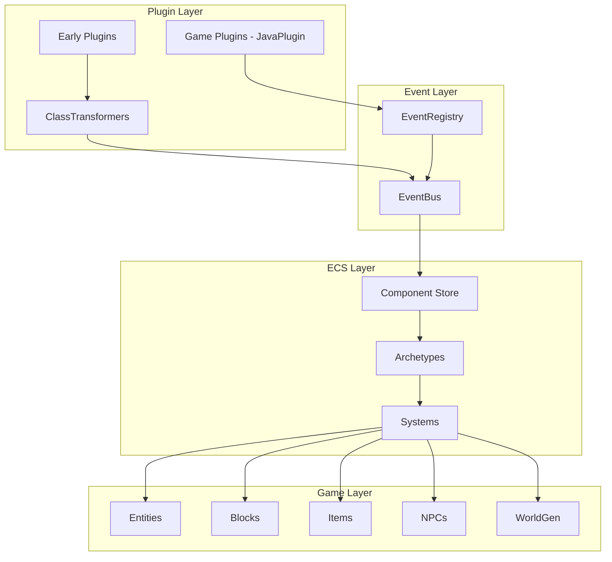
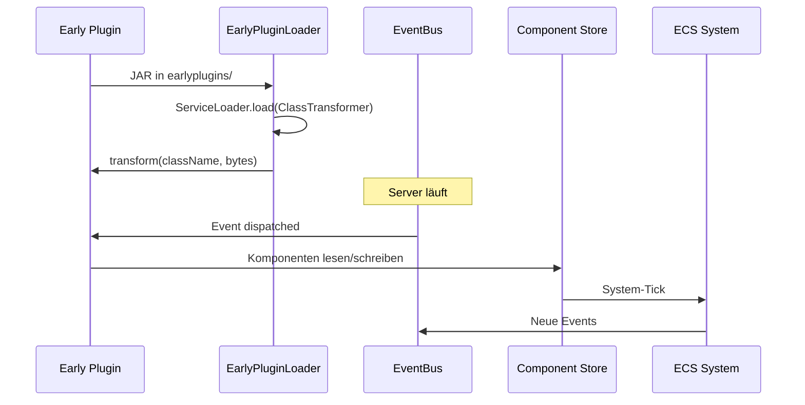

# Architecture Overview

## Core Concepts

1.  **Server-Authoritative**: The server controls all logic. The client is a "dumb" terminal.
2.  **ECS Driven**: Game logic is built on Entity-Component-System.
3.  **Data-Driven**: Assets (Items, Blocks, UI) are defined in JSON.

## Process Layout

*   **Server Process**: Runs Java (`HytaleServer.jar`). Loads mods.
*   **Client Process**: Runs C++. Connects to server (even in singleplayer).

## Modding Layers

1.  **Game Plugins** (`JavaPlugin`): Scripts, Content, Gameplay.
2.  **Early Plugins** (`ClassTransformer`): Bytecode patches.
3.  **Mixins** (Hyxin): Structured code injection.



---

## Hauptkomponenten

### 1. Plugin-System

#### A. Game Plugins (`com.hypixel.hytale.server.core.plugin`) — 95% aller Mods

| Klasse | Beschreibung |
|--------|--------------|
| `PluginManager` | Lädt JARs aus `mods/` |
| `JavaPlugin` | Basisklasse für Standard-Plugins |
| `JavaPluginInit` | Konstruktor-Parameter für Plugin-Init |
| `PluginBase` | Superklasse mit `setup()`, `start()`, `shutdown()` |

#### B. Early Plugins (`com.hypixel.hytale.plugin.early`) — Nur Bytecode-Modifikation

| Klasse | Beschreibung |
|--------|--------------|
| `EarlyPluginLoader` | Lädt JARs aus `earlyplugins/` |
| `ClassTransformer` | Interface für Bytecode-Transformation |
| `TransformingClassLoader` | Custom ClassLoader für transformierte Klassen |

### 2. Event-System (`com.hypixel.hytale.event`)

Vollständiges Event-Pub/Sub-System:

| Interface/Klasse | Beschreibung |
|------------------|--------------|
| `IEvent<KeyType>` | Basis-Interface für Events |
| `IAsyncEvent<KeyType>` | Async Events mit CompletableFuture |
| `ICancellable` | Abbrechbare Events |
| `IEventBus` | Hauptbus für Event-Dispatch |
| `IEventRegistry` | Event-Registrierung |
| `EventPriority` | FIRST, EARLY, NORMAL, LATE, LAST |

### 3. ECS-System (`com.hypixel.hytale.component`)

Datenzentriertes Entity Component System:

| Klasse | Beschreibung |
|--------|--------------|
| `Store` | Haupt-Datenspeicher (98KB!) |
| `Archetype` | Entity-Typ-Definition |
| `Component` | Marker für Komponenten |
| `ComponentRegistry` | Komponentenregistrierung |
| `SystemGroup` | Gruppierung von Systems |
| `Holder` | Entity-Referenz mit Komponenten |

### 4. Registry-System (`com.hypixel.hytale.registry`)

Zentrales Registrierungssystem:

| Klasse | Beschreibung |
|--------|--------------|
| `Registry` | Generische Registrierung |
| `Registration` | Einzelne Registrierungseinheit |

---

## Package-Hierarchie

```
com.hypixel.hytale/
│
├── plugin/                    # 🔌 MOD-EINSTIEGSPUNKT
│   └── early/
│       ├── EarlyPluginLoader  # Lädt Plugins
│       ├── ClassTransformer   # Interface für Mods
│       └── TransformingClassLoader
│
├── event/                     # 📢 EVENT-SYSTEM
│   ├── IEvent, IAsyncEvent
│   ├── ICancellable
│   ├── IEventBus, EventBus
│   ├── IEventRegistry, EventRegistry
│   └── EventPriority
│
├── component/                 # 🧩 ECS-KERN
│   ├── Store, Archetype
│   ├── Component, ComponentRegistry
│   ├── Holder, Ref
│   ├── system/               # ECS-Systems
│   ├── query/                # Entity-Queries
│   ├── event/                # ECS-Events
│   └── spatial/              # Räumliche Indizierung
│
├── registry/                  # 📋 REGISTRIERUNGEN
│   ├── Registry
│   └── Registration
│
├── common/                    # 🔧 UTILITIES
│   ├── id/                   # ID-Systeme
│   ├── math/                 # Mathematik
│   └── util/                 # Helfer
│
├── protocol/                  # 🌐 NETZWERK
│   └── packets/              # Alle Packet-Typen
│
├── builtin/                   # 📦 VANILLA-MODULE
│   ├── crafting/
│   ├── worldgen/
│   ├── portals/
│   ├── mounts/
│   ├── adventure/
│   ├── npc*/
│   ├── randomtick/
│   └── ... (32 Module)
│
└── server/                    # 🖥️ SERVER-LOGIK
    ├── core/
    │   ├── modules/          # Server-Module
    │   └── Options           # Server-Konfiguration
    ├── npc/                  # NPC-AI
    ├── spawning/             # Spawning-Logik
    └── worldgen/             # Weltgenerierung
```

---

## Datenfluss



---

## Wichtige Dateipfade

| Pfad | Beschreibung |
|------|--------------|
| `mods/` | Plugin-JARs (Standard) |
| `earlyplugins/` | Early-Plugin-JARs (Bytecode) |
| `worlds/` | Weltdaten |
| `assets/` | Spiel-Assets |
| `config/` | Konfigurationsdateien |

---

## Weiterführende Dokumentation

- [ECS-System Details](ecs.md)
 - [Event-System](../systems/events.md)
 - [Task-Scheduling](../systems/tasks.md)
 - [Permissions](../systems/permissions.md)
 - [Inventory](../systems/inventory.md)
